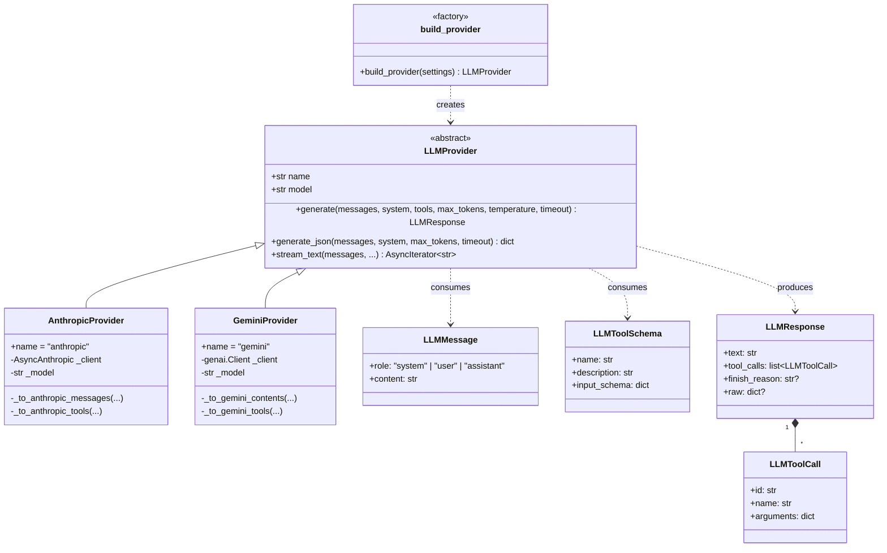
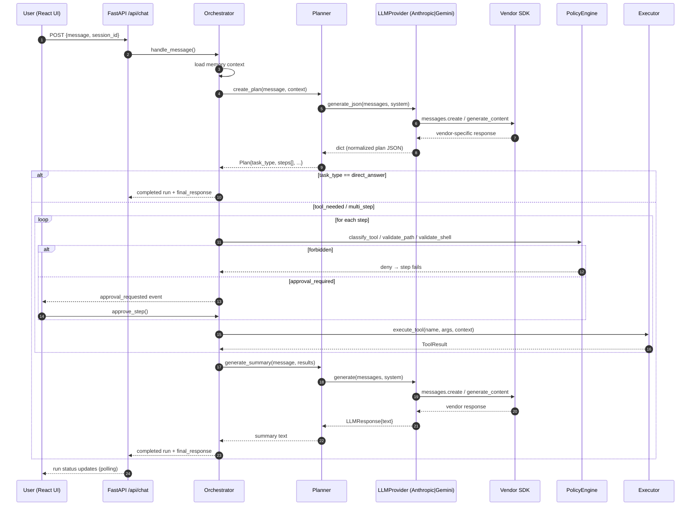
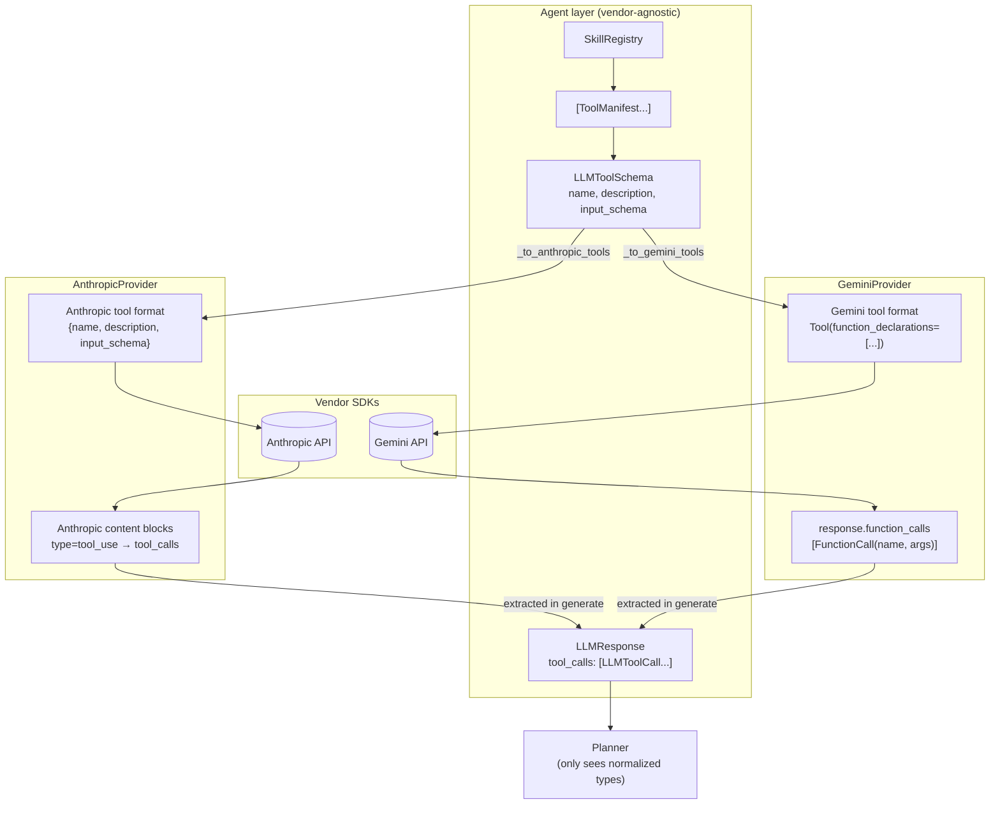

# LLM Provider Abstraction

## Why

Before the refactor, `core/planner.py` imported `AsyncAnthropic` and made
Anthropic-specific calls directly. Adding a second model meant rewriting the
planner. After the refactor, the planner depends only on the abstract
`LLMProvider` interface in `apps/api/providers/base.py`; concrete providers
translate that interface to the vendor's SDK.

The agent doesn't know — or care — which model is on the other end.

## Layout

```
apps/api/providers/
├── __init__.py           # public re-exports
├── base.py               # LLMProvider ABC + LLMMessage/LLMResponse/LLMToolSchema/LLMToolCall
├── errors.py             # provider-agnostic exception hierarchy
├── factory.py            # build_provider(settings) + ProviderType enum
├── anthropic_provider.py # AnthropicProvider — wraps AsyncAnthropic
└── gemini_provider.py    # GeminiProvider — wraps google-genai
```

## The four key types

| Type             | Role                                              |
|------------------|---------------------------------------------------|
| `LLMMessage`     | Normalized chat message: `role` + `content`       |
| `LLMToolSchema`  | Normalized tool/function definition (JSON Schema) |
| `LLMToolCall`    | Normalized tool invocation from the model         |
| `LLMResponse`    | Normalized response: `text`, `tool_calls`, `finish_reason`, `raw` |

Every provider takes the normalized inputs, translates them to the vendor's
native shape, calls the SDK, and translates the response back. **Anything
above the providers/ boundary deals only in these four types.**

## Switching providers

Set `LLM_PROVIDER` in `.env`:

```dotenv
# Use Claude
LLM_PROVIDER=anthropic
ANTHROPIC_API_KEY=sk-ant-...
# ANTHROPIC_MODEL=claude-sonnet-4-6   # optional override

# OR use Gemini
LLM_PROVIDER=gemini
GEMINI_API_KEY=AI...
# GEMINI_MODEL=gemini-2.5-flash               # optional override
```

Restart the backend. `GET /api/health` reports the active provider and
model:

```json
{
  "llm_provider": "gemini",
  "llm_model": "gemini-2.5-flash",
  "api_key_configured": true,
  ...
}
```

## Adding a new provider

Suppose you want to add OpenAI. The recipe is **five small steps**, none of
which touch the planner, orchestrator, executor, or any tool:

1. **Implement** `apps/api/providers/openai_provider.py`:
   ```python
   class OpenAIProvider(LLMProvider):
       name = "openai"
       def __init__(self, api_key: str, model: str) -> None: ...
       async def generate(self, messages, *, system=None, tools=None,
                          max_tokens=2048, temperature=None, timeout=60.0): ...
   ```
2. **Add an enum member** in `providers/factory.py`:
   ```python
   class ProviderType(str, Enum):
       ANTHROPIC = "anthropic"
       GEMINI    = "gemini"
       OPENAI    = "openai"          # ← new
   ```
3. **Add a branch** in `build_provider()`:
   ```python
   if ptype is ProviderType.OPENAI:
       from apps.api.providers.openai_provider import OpenAIProvider
       return OpenAIProvider(api_key=settings.openai_api_key, model=settings.openai_model)
   ```
4. **Add settings fields** in `apps/api/config.py`:
   ```python
   openai_api_key: str = ""
   openai_model: str = "gpt-4o-mini"
   ```
5. **Document** the new value in `.env.example` and the README.

Same recipe applies to Ollama, Groq, DeepSeek, or any local model — the
interface doesn't change.

## Exception mapping

Every provider catches its SDK's exceptions and re-raises one of:

| Provider error              | Cause                              | When the planner sees this... |
|-----------------------------|------------------------------------|--------------------------------|
| `ProviderConfigError`       | Missing API key, unknown provider  | Surfaces as "LLM provider not configured" run-failure |
| `ProviderAuthError`         | 401/403 from vendor                | Becomes `PlannerError` → run fails with message |
| `ProviderRateLimitError`    | 429 from vendor                    | Becomes `PlannerError`; caller may retry |
| `ProviderTimeoutError`      | `asyncio.TimeoutError` past timeout| Becomes `PlannerError` |
| `LLMProviderError` (base)   | Anything else                      | Becomes `PlannerError` |

Upstream code never imports anything from `anthropic.*` or `google.genai.*`.

## JSON-mode contract

Mini-OpenClaw's planner uses **JSON-mode prompting**: the system prompt
instructs the model to emit a JSON plan as its text response. Every provider
exposes a `generate_json(...)` method that:

1. Calls the SDK with whatever steering yields the cleanest JSON
   (Anthropic: prompt-only; Gemini: `response_mime_type="application/json"`).
2. Strips any stray ```json …``` fences as a defence-in-depth measure.
3. Parses the result and returns a `dict`.

This contract works identically across vendors and across local models like
Ollama, where native tool-calling APIs differ widely.

Native tool calling is also supported on the `LLMResponse.tool_calls` field —
both providers populate it correctly — but the V1 planner doesn't rely on it.
Future agents can opt in without re-engineering the interface.

## Streaming

`LLMProvider.stream_text(...)` exists as an extension point. The V1 planner
does not stream. When a future caller needs streaming, override `stream_text`
in each provider (Anthropic SDK: `client.messages.stream`; Gemini SDK:
`client.aio.models.generate_content_stream`).

---

# Diagrams

## 1. Provider abstraction



## 2. Request flow (planner-driven)



## 3. Tool-calling normalization



Whichever provider is active, the agent sees the same `LLMToolSchema` going
in and the same `LLMToolCall` list coming out. Adding OpenAI / Ollama / etc.
adds a new column to the middle — nothing else moves.
